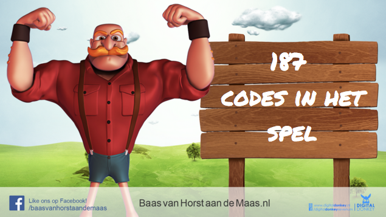

# qrcode_game
The end game - Baas van Horst aan de Maas 2015 - QR code scanning

Teams can register 10 phones each with use of a registration QR Code. Every QR code that is scanned with that specific device will be added to that team. After scanning a QR code, the code is no longer active. The goal is to scan as much as QR codes as possible until there are no unique ones left.

Creating a PDF from a list of qr_codes (text): https://github.com/reinzor/qr_code_pdf

NOTE: Just a dump from the server dir as backup - Impl. is really hacky / adhock but works - If you want to use this, it m8 take you some time. Also no DB scheme here xD
